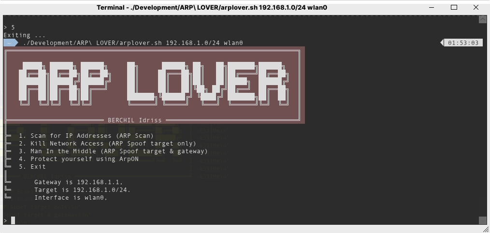

# ARP Lover

A script for scanning, shutting, and Man in the Middle-ing a local network based on ARP protocol, by applying ARP spoofing.

This project was made for fast and easy execution by creating an script interface.

### Requirements (may change)
Packages:
-   nmap
-   dsniff
-   wireshark
-   arpon

### License
ARP Lover is under the BSD 4-Clause License